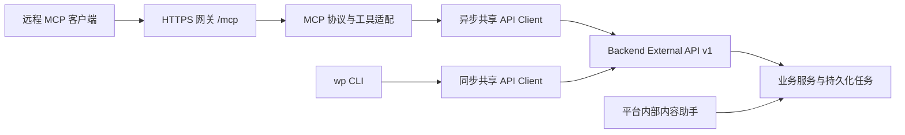

# MCP 服务实施规划：远程、多用户、通用业务工具

规划日期：2026-10-03。用户已明确首期优先远程部署，供多个用户或客户端连接。

状态：设计方案，尚未实现、联调或发布。现有 `mcp-server/` 仍为历史骨架；本文不表示其中的工具和启动方式已经可用。CLI 继续按现有发布范围维护。

本仓执行工作包为 A0～A9，详见第 11～18 节；主仓执行工作包为 M0～M7，详见[远程 MCP 主仓实施计划](https://github.com/LLMxPM/web-presentation/blob/main/docs/developer/mcp-implementation-plan.md)。授权、委托、撤销等跨仓新增接口的候选契约集中在主仓计划维护；本文只引用交接，不复制第二版 DTO。

## 1. 设计结论

MCP 采用主仓内容助手的「少量通用业务工具 + 按需操作手册」形式，通过共享 API Client 调用 External API v1。CLI 保持面向终端和文件工作流的资源命令树。两者共享 HTTP 契约与客户端能力，各自维护调用入口和输出。

远程入口使用 HTTPS + Streamable HTTP，采用逐请求用户身份和显式工作空间。平台增加外部授权与委托访问能力，MCP 服务只维护协议适配和调用映射。业务持久化、权限、幂等、版本冲突及重任务队列继续由 Backend 负责。



MCP 不启动主仓 Agent Run，不导入 `app.ai`，不调用 Click 命令，不通过子进程执行 `wp`，不连接业务数据库、Redis、Runtime 或 Renderer。

### 首期优先级：先交付 MCP

本期直接复用现有 External API，不以内部助手迁移到标准 API、建立统一业务操作层或合并内外工具注册表为前置条件。内部助手与外部接口现有的参数差异由 MCP 按外部契约适配；已有内部助手执行、写围栏和自动续跑链路保持现状。

主仓改动限定为远程多用户认证与隔离，以及 MCP 创作闭环中经核实缺失的必要 API 能力。契约模块提取和异步客户端仅按 MCP 实际需要推进。统一内外业务契约作为后续独立议题，待 MCP 接入稳定、重复维护成本明确后再评估。

## 2. 三种入口的差异

| 维度 | 主仓内容助手 | CLI | 计划中的 MCP |
| --- | --- | --- | --- |
| 工具形态 | 通用 list/get/create/update 等工具 | `wp page create/edit/source` 等资源命令树 | 通用业务工具，任务和媒体独立入口 |
| 参数来源 | `tool_specs.py`、内部参数模型 | Click 参数、文件、当前 OpenAPI | MCP 路由参数 + External OpenAPI 派生的业务参数 |
| 上下文 | 平台注入 user/workspace、Run 焦点与工作集 | Profile、环境配置、`--workspace` | 每请求认证身份、显式空间和目标 ID |
| 重任务 | Deferred/ExternalBatch 恢复模型运行 | 默认等待，或 `--no-wait` + `job wait` | 返回 Backend Job，另行查询/短等待/取消/重试 |
| 文件 | 会话可信附件 ID | 客户端本地文件路径 | JSON/文本、平台资产 ID；上传通道单独规划 |
| 结果 | 模型摘要与 Editor 刷新信息 | 终端文本、JSON、落盘文件 | 结构化结果、文本兼容块、图片和资源链接 |

不能把内部工具 Schema 或 CLI 参数原样作为 MCP Schema。已核对到的具体差异：

- 主仓组件源码编辑使用 `base_published_version_no` 与 `base_draft_hash`；External API 使用 `base_version_no` 与 `base_draft_hash`，必填约束也须按外部 DTO 校验。
- 主仓创建页面支持同时安排路由；当前 External 页面创建 DTO 没有这组字段。MCP 不承诺「创建页面 + 路由」原子操作，需要时分别调用，或先补平台契约。
- 主仓上传使用会话可信 `attachment_id`；远程 MCP 没有该上下文，也不能读取用户机器上的本地路径。
- 内部 guide operation key 与 External operation key 不同；MCP 手册使用外部操作键及必要的视图选择，不能直接导出 `tool_specs.py`。

## 3. 现有实现与缺口

已具备 External 资源接口、规范、Runtime Kit、字体、预览、截图、Mutation Job，以及共享客户端的 HTTP/PAT/空间/幂等/错误/同步轮询。Backend 幂等记录按 user/workspace/operation/key 去重。

历史 MCP 骨架不能直接上线：

1. `server.py` 的全局 `_gateway` 使用 `WP_TOKEN/WP_WORKSPACE_ID`，不能承载多个用户的身份和默认空间。
2. `backend.py#get_guides()` 调用的 `ApiClient.get_operation_guide()` 已不存在；当前公开自省入口是 OpenAPI、capabilities 和 standards。
3. 工具仅覆盖少量查询、元数据修改和 Job 操作，创作闭环未完成。
4. 结果只做 JSON 字符串化，缺少结构化输出契约与图片输出。
5. 共享客户端使用同步 HTTP 和 `time.sleep()` 轮询，需要增加异步实现。
6. External 鉴权只验证 PAT，`ExternalAuthContext` 直接关联 `ApiAccessToken`，尚无远程 MCP OAuth 授权链路。
7. MCP 测试只检查少量工具名称，未覆盖认证、隔离、真实传输和业务映射。
8. `mcp` 依赖声明为 `>=1.0.0`，锁文件实际为 2.0.0；恢复开发时须明确 SDK 主版本范围和客户端协议兼容矩阵。

## 4. 拟议工具界面

保留十五个稳定入口，下表不是当前可调用清单。

| 工具 | 职责 |
| --- | --- |
| `wp_get_context` | 当前身份、授权空间列表；指定空间时返回 capabilities，无全局切换空间副作用 |
| `wp_get_operation_guide` | 紧凑索引，或按操作键/视图返回准确参数、执行方式与示例 |
| `wp_get_code_standards` | 当前用户的 page/component 规范 |
| `wp_list_entities` | 列表和搜索 project/page/component/asset/theme/style/runtime_kit/font |
| `wp_get_entity` | 按 view 读取详情、源码、版本、依赖、配置、路由或资源内容 |
| `wp_create_entity` | new/copy，源码创建进入 Backend Job，首期不混入上传 |
| `wp_update_entity` | metadata/content/configuration/route_tree/apply_style 等明确分支 |
| `wp_archive_entity` | 首期单项归档；可信确认完成后扩展整批原子归档 |
| `wp_validate_entity` | current/content/edits 校验或资源内容差异预览 |
| `wp_execute_action` | 首期仅组件 publish，不是任意 HTTP 或命令执行器 |
| `wp_get_mutation_job` | 查询或短等待，返回 Backend Job 最新状态 |
| `wp_cancel_mutation_job` | 显式请求业务取消 |
| `wp_retry_mutation_job` | 对允许重试的失败任务创建新 Job，保留原基线 |
| `wp_create_preview` | 页面/项目预览 artifact，返回地址和到期信息 |
| `wp_get_page_screenshot` | 最新 PNG 和页面版本，通过 MCP 图片内容返回 |

业务工具显式携带 `workspace_id`；身份、Backend 地址和凭证由服务器确定，不能通过模型参数传入。项目页面列表显式携带 `project_id`。Job ID 和 Resource URI 只是定位符，每次使用仍检查用户与空间权限。

通用工具外层使用严格的 `resource_type/view/mode/action` 枚举与组合校验；`payload/filters/edits` 依据选定操作的当前 Schema 做第二层校验，拒绝未知字段和不支持的组合。避免任意 `method + path + body` 工具，也避免在 `tools/list` 塞入全平台巨型联合 Schema。

首期不提供平台 Agent 会话、`ask_user`、图片生成/识别、Build 执行、永久删除或 Restore。截图用于供客户端模型看图，不额外启动平台图片识别模型。

## 5. 手册与契约事实源

| 元数据 | 权威来源 |
| --- | --- |
| HTTP 参数、DTO、错误与业务校验 | Backend 路由及 OpenAPI |
| operation、Scope、幂等要求 | Backend `external_operations.py`；capabilities 提供用户当前授权结果 |
| MCP 工具名、参数装配、结果投影 | agent-kit 的 MCP binding 注册表 |

binding 只保存操作键、视图、实际方法/路径绑定和模型交互说明，不抄写 HTTP DTO。手册、分派、可用操作过滤和映射测试从同一注册表派生。

同一 operation 可能对应多个视图：例如 `page.get` 授权详情、源码和版本路由。guide 用 `operation_key + view` 选择精确契约，不能只根据注册表中的主路径推测全部视图。

实施要求：

1. 把 CLI `wp/openapi_contracts.py` 的纯解析能力提取至 `wp_api_client`，Click 命令树遍历和展示留在 CLI；补充响应 Schema 解析及 MCP 所需 JSON Schema 引用转换。
2. 按当前 Backend OpenAPI 组装手册。引用完整解析后才返回，失败不使用内置 DTO、旧缓存或部分手册冒充当前契约。
3. 若导出 operation 机器元数据，优先在 External OpenAPI 增加由已有注册表派生的扩展字段，覆盖真实路由视图及动态 Job 权限；不开放内部助手目录，不另造静态 `/guides`。
4. 可用操作 = 已实现 binding ∩ 当前空间 capabilities ∩ 当前有效契约。通用工具名稳定，guide 索引按用户过滤，执行时再次鉴权。
5. 共享缓存仅保存公开契约；用户规范、能力与数据按授权主体和空间隔离。缓存失效或刷新失败不能回退旧 Schema 继续写入。

手册说明自动校验和冲突恢复：页面/组件创建与源码更新已校验，无须重复调用 validate；版本冲突后重新读取并形成修改，不能自动提高版本号重放旧编辑。

| 意图 | CLI | MCP | External API（省略 `/api/v1`） |
| --- | --- | --- | --- |
| 页面源码 | `wp page source 21` | get_entity：page、view=source、target_id=21、workspace_id=1 | `GET /pages/21/source` |
| 修改源码 | `wp page edit 21 --base-version-no 3 --edits-file edits.json` | update_entity：page、action=content；payload 为实际 edits 和 base_version_no | `POST /pages/21/edits` |
| 文本资源 | `wp asset create --payload-file asset.json` | create_entity：asset、mode=new；payload 内联 content | `POST /assets/content` |

## 6. 远程认证与用户隔离

正式远程首期推荐 OAuth 2.1 授权码 + PKCE。平台登录和授权记录由主仓维护，MCP 作为资源服务器验证令牌。发现、资源元数据和 audience 要求按[官方 Authorization 规范](https://modelcontextprotocol.io/specification/2026-07-28/basic/authorization)实现。

建议链路（当前尚未实现）：

1. 客户端发现 MCP Protected Resource Metadata 与平台授权服务。
2. 用户在平台登录，授权客户端、工作空间和已有 External Scope；签发 audience 指向 MCP 的访问令牌。
3. MCP 每请求验证 issuer、audience、期限、授权状态，形成不可变请求上下文。
4. MCP 以自身服务身份向平台授权服务交换短期 Backend 委托凭证，限定 External API audience，保留原用户和授权范围。可采用 [RFC 8693 Token Exchange](https://datatracker.ietf.org/doc/html/rfc8693)，只允许指定 MCP 服务交换，不能扩大 Scope 或空间。
5. Backend 将 PAT 与委托凭证归一为 External Principal，继续校验当前用户、实时成员关系、对象归属和 Scope。

CLI 保持 PAT 登录。MCP 不保存一枚所有用户共用的 PAT，也不把客户端 MCP 令牌直接当作 Backend Bearer 透传；两种令牌分别校验接收方和权限。[MCP 安全实践](https://modelcontextprotocol.io/docs/2026-07-28/tutorials/security/security_best_practices)

主仓需增加外部授权模块、授权记录、客户端规则、登录授权页面与委托凭证校验。采用成熟 OAuth 实现，不在 MCP handler 中手写协议。授权页遵循主仓 `DESIGN.md`。首批受控客户端可预注册 client_id，接入更多客户端时再按兼容矩阵扩展注册/发现机制，不能假设所有客户端都支持自定义 Bearer Header。

隔离约束：

- 请求上下文独立保存 principal、client/grant、workspace 和 request ID；共享连接池不保存用户默认 Authorization Header。
- workspace 参数同时受授权范围和实体归属约束；没有可跨请求修改的全局默认空间。
- Backend 每次检查授权是否撤销，退出空间后阻止后续调用，不能只等待 JWT 到期；缓存不得绕过校验。
- Token 刷新不改变用户身份；幂等继续保持 user/workspace/operation/key 语义，同键异载荷冲突。
- 多副本不依赖进程内登录 Session 或粘性路由；Job、授权及有安全意义的确认状态由平台持久化。

授权发现地址、交换路径、凭证 DTO、错误码与撤销时限在 P0 单独冻结，本文不把它们声明为已有接口。

## 7. 任务、幂等和结果

源码重操作提交后立即返回 Backend `job_id` 与状态，默认不等待完整编译渲染。Job 查询默认不等待，可选最长约 20 秒短等待；到期返回最新非终态及继续查询提示，不把等待超时当作 Job 失败。

断连、HTTP 取消或 MCP 重启只结束本次等待；已入队 Job 继续执行，只有 cancel 工具发起业务取消。区分「取消已请求」与「已取消」。retry 返回新 Job ID，保留原版本/hash 基线。首期不另建一套 MCP 持久任务系统。

对有幂等要求的写工具要求显式 `idempotency_key`，在 HTTP 请求前确定；超时或响应丢失后保留原键重试，不依赖当前客户端每调用自动生成 UUID 的默认行为。

建议 MCP 结果包络（不改变 CLI 原始 DTO）：

```json
{
  "ok": true,
  "operation": "page.edit",
  "workspace_id": 1,
  "data": {"job_id": "...", "status": "pending"},
  "meta": {"request_id": "...", "idempotency_key": "..."}
}
```

共享客户端增加可选响应元数据接口，供 MCP 获取成功响应的 `X-Request-ID`；现有成功 JSON 返回不保留该 Header。

结果提供 `structuredContent` 与文本兼容块，输出 Schema 覆盖成功/错误。API 和业务失败设置 `isError=true`，保留错误码、字段路径、request ID、retry-after；协议错误由 SDK 处理。校验执行成功而源码不合法，返回 `ok=true, data.valid=false`；查 Job 成功而任务失败，保留 Job 失败状态。[MCP Tools 规范](https://modelcontextprotocol.io/specification/2026-07-28/server/tools)

列表精简并分页；源码通过显式 view 获取，不静默截断后让模型编辑。annotations 按真实副作用设置，只有相同参数确实幂等才标幂等；注解不代替授权和确认。

## 8. 确认、文件与媒体

首期只开放单项归档，免额外确认。批量动态确认作为 P3 独立扩展；完成可信用户交互、持久确认和 Backend 强制校验后，才开放 Backend 原子 batch-archive，不循环单项归档。

批量确认使用客户端支持的用户交互机制，绑定用户、空间、操作、规范化目标和期限。拒绝、缺少交互能力或目标改变时不执行；模型填 `confirmed=true` 不是确认依据。不支持可信确认的客户端禁用批量分支并提示通过平台完成，不能拆单绕过。跨副本的确认票据与一次性消费记录由平台维护，不重用内部 AgentRun/HITL。

远程文件策略：

- Vue/SVG/Markdown 直接传文本；edits、previewSchema、route tree 直接传 JSON。
- 首期支持既有资产引用与文本资产创建，不接收本地路径、任意服务器路径或假定通用附件 ID。
- 后续二进制上传走 Backend 受控通道，签发绑定用户/空间、期限、大小和 MIME 的上传凭据；完成后引用平台资产 ID。客户端如何上传按目标宿主另行适配。
- 首期不提供任意 URL 抓取作为上传替代。

预览返回已有的短期地址和到期信息；截图返回 MCP image 与页面版本，不能返回 MCP 服务器本机路径。当前截图接口会等待 Backend 队列刷新 PNG，须验证实际耗时和并发预算；超过宿主时限时先补 Backend 异步截图契约，不在 MCP 自建渲染队列。

Resources 可补充规范、手册和源码，复用同一权限与契约层；首期主要流程仅靠 Tools 即可完成。

## 9. 模块与部署

```text
packages/api-client/src/wp_api_client/
  client.py                 # 保留 CLI 同步接口
  async_client.py           # MCP 异步 HTTP 与有界轮询
  contracts.py              # OpenAPI 请求/响应契约与引用解析
  response.py               # 可选响应元数据
mcp-server/src/wp_mcp/
  server.py                 # SDK 装配、生命周期、传输入口
  settings.py               # 部署配置，不保存共享用户 PAT
  auth.py                   # 令牌验证与委托交换
  context.py                # 不可变请求上下文
  bindings/                 # 按资源拆分 MCP→External 映射
  tools/                    # 通用业务、任务、预览与媒体
  guides.py                 # 从注册表和当前契约派生手册
  results.py                # 包络、错误、摘要与媒体转换
```

同步/异步客户端共享 Header、错误和契约代码，分别实现传输与等待，不复制整个客户端；用应用生命周期关闭连接池。MCP 包限制 SDK 主版本，并用 uv 锁定经验证版本。

同步/异步是调用方式选择，不是 CLI 或 MCP 协议的强制要求。本期保留 CLI 的 `ApiClient` 同步接口，增加 MCP 使用的 `AsyncApiClient`；CLI 单次命令无需为了 MCP 全面改为 async。两者都可提交 Backend 异步 Job，HTTP await 与业务 Job 是否完成是两个维度。未来若统一成 async 核心，作为独立迁移处理，不在本期反复创建事件循环或为每次 HTTP 调用包装 `asyncio.run()`。不能在 async MCP handler 中直接调用阻塞 HTTP 或 `time.sleep()`。

网关发布 `/mcp`，配置 TLS、Origin/Host 校验、请求大小限制、按用户并发预算及流式超时；服务提供健康检查。生命周期、协议版本和多轮交互由 SDK 处理，按真实客户端矩阵验证。新版 Streamable HTTP 已调整协议会话与流端点，不能把旧版 session/SSE 假设写死。[官方传输规范](https://modelcontextprotocol.io/specification/2026-07-28/basic/transports/streamable-http)

审计关联 MCP/Backend request、grant/client、workspace、operation、目标和 Job ID，不记录 Token、完整源码或图片 Base64。MCP 部署产物归 agent-kit；主仓负责授权、API 和必要 Gateway 路由集成。

## 10. 分期与验收

| 阶段 | 工作 | 退出条件 |
| --- | --- | --- |
| P0：冻结契约 | 首批客户端/版本，授权、委托、撤销、确认和工具 binding；记录 API 差异 | 每工具有真实映射；新增接口明确路径、Scope、DTO、错误；不混用内部 Schema |
| P1：远程只读 | 授权/Principal、HTTP、请求上下文、异步客户端、guide、规范、列表/详情 | 两用户两空间交错调用隔离；撤销生效；真实客户端可登录并读取 |
| P2：创作闭环 | 写工具、Job、发布、预览/截图、单项归档、单实例交付和发布文档 | 创建→查 Job→源码编辑→截图/预览通过；超时重试不重复写入；正式测试发布门禁恢复 |
| P3：交付扩展 | 批量确认、多副本故障演练、文件上传、Resources、更多客户端 | 对应扩展真实验收；多副本不依赖粘性路由 |

首期可交付为 P0～P2，远程多用户认证是前置条件。多副本设计约束从首期落实，正式支持在演练后声明。stdio 可后续复用工具层，不代替远程版验收。

必要验证（确认相关场景在 P3 启用对应能力时执行，其他为首期门禁）：

- 契约：binding 方法/路径、请求/响应引用、capabilities、未知分支拒绝；Guide、Schema 与真实请求一致。
- 隔离：错误 audience、过期/撤销、Scope 缺失、用户/空间交叉、Job/Resource 越权、连接池 Header 串用、Origin/Host。
- 任务：同键重放/异载荷、响应丢失、重启查 Job、版本/hash 冲突、短等待超时、显式取消及 retry 新 ID。
- 确认：接受/拒绝、目标改变、过期/重放、不支持交互、跨副本消费和批量原子失败。
- 协议：真实 HTTP 客户端、SDK 生命周期/版本处理、结构化输出、错误和图片；名称检查不能代替传输测试。
- 业务：真实 Backend→Renderer→Runtime 截图与 PNG 返回，以及组件发布后引用。
- CLI：共享模块变更后运行 `uv run pytest packages/api-client/tests packages/cli/tests`。
- 主仓：DTO 改动运行 codegen/generated contracts；External API/Gateway 改动运行真实 Nginx 回归，发布后从外部 Gateway 检查 OpenAPI。

实施启动时同步 agent-kit `AGENTS.md` 的默认修改和验证边界；验收后再更新 README、MCP README、Skill 和发布说明为可用。主仓 `docs/developer/mcp.md` 只维护平台边界及新增依赖，不复制 MCP 工具清单。

## 11. A0：冻结本仓实现基线与范围

优先级 P0；依赖主仓 M0 共同决策。所有任务默认待实施，不能把已有骨架当作完成项。

- [ ] 记录当前 CLI、api-client、MCP SDK/协议版本和两仓 commit；核对历史 MCP 测试、入口和安装是否实际可运行。
- [ ] 移除规划中的失效调用假设，明确 `get_operation_guide` 将由本仓契约层生成；不能恢复一个不存在的 Backend `/guides` 来掩盖问题。
- [ ] 确定首批真实客户端、版本和接入方式；记录授权发现/注册、结构化结果、图片、工具参数规模及超时限制。至少一个真实宿主验收，另用 SDK 客户端做协议测试。
- [ ] 锁定经验证的 SDK 主版本和协议组合，检查 Python 版本与打包；不得只保留无限上界的 `mcp>=1.0.0`。
- [ ] 冻结第 12 节 binding 清单，标记首期启用、待主仓契约和延期项；确认工具名变化不需要迁移正式用户，因为历史骨架尚未作为可用服务发布。
- [ ] 与 M0 冻结 OAuth 元数据、受众、Token Exchange、撤销、错误和服务配置；明确 API Token 与 MCP Token 的接收方。
- [ ] 更新 AGENTS 开发边界：MCP 恢复实施后纳入协议、隔离和共享客户端回归；CLI 用户与 Skill 默认入口在正式验收前不变。

交付物：可审查的 binding 初稿、SDK/客户端矩阵、授权契约引用、首期明确排除项和最低主仓能力要求。退出条件是各工作包无需自行猜测另一仓接口。

## 12. 工具绑定与调用约定

### 12.1 外层参数

下表为计划中的 MCP 外层约定，业务字段通过对应 API 的当前 Schema 派生。精确类型与组合规则在 A0/A4 中固化为本仓唯一 binding，不把此表变成第二份手工 DTO。

| 参数 | 使用规则 |
| --- | --- |
| `workspace_id` | 正整数；所有空间业务调用显式传入；context 未选空间时仅返回身份和授权空间列表 |
| `resource_type` | 工具自身支持的有限枚举；不默认所有 CRUD 支持全部资源 |
| `target_id` / `project_id` | 从操作规定的位置映射；page 列表需要 project_id，不能从进程默认项目推断 |
| `view` | detail/source/draft/versions/version/dependencies/configuration/route_tree/content 等按资源开放的有限组合 |
| `mode` / `action` | create 的 new/copy、update 的 metadata/content/configuration/route_tree/apply_style 等有限分支；以 binding 为准 |
| `payload` / `filters` | 对选定路径的 body/query Schema 校验；分离路径、查询和请求体，保留省略与显式 null 的差异 |
| `idempotency_key` | 对注册表要求的写入必须显式提供非空值，并满足服务端长度限制；一次逻辑请求始终复用同一个键 |
| `wait_seconds` | Job 查询默认 0，首期建议上限 20；越界拒绝，不让模型任意延长服务端等待 |
| `version_no` | 只有历史版本视图需要；不能与 source 默认视图混淆 |

Token、用户 ID、Backend endpoint、任意 HTTP method/path、服务器文件路径不能作为工具可选参数。目标 ID 与 workspace 的一致性由 Backend 最终校验。Runtime Kit 的 item 为路径段字符串，按路径段编码，不能用它注入 URL。

### 12.2 资源映射基线

下表路径省略 `/api/v1`。这是经现有路由核对的实施起点；实际绑定需经过当前 OpenAPI 及主仓 M0 对拍。业务请求字段不在表中复制。

| MCP 意图 | operation / 视图 | HTTP 映射 | 处理要求 |
| --- | --- | --- | --- |
| context 身份/空间 | auth.whoami、workspace.list | `GET /auth/whoami`、`GET /workspaces` | 不设置全局默认空间 |
| context 空间能力 | system.capabilities | `GET /workspaces/{workspace_id}/capabilities` | 按授权过滤 guide；不代替执行鉴权 |
| 页面/组件规范 | standards.page/component | `GET /standards/page`、`GET /standards/component` | 用户有效规范，禁止跨用户缓存 |
| 项目列表/详情 | project.list/get | `GET /projects`、`GET /projects/{project_id}` | 列表分页、详情按需 |
| 项目配置/路由 | project.configuration.get、project.route.get | `GET /projects/{project_id}/configuration`、`GET /projects/{project_id}/route-tree` | 返回准确结构，不从内部 Run 推导 |
| 页面列表/详情 | page.list/get | `GET /projects/{project_id}/pages`、`GET /pages/{page_id}` | 详情不默认塞完整源码 |
| 页面源码/历史 | page.get + view | `GET /pages/{page_id}/source`、`GET /pages/{page_id}/versions`、`GET /pages/{page_id}/versions/{version_no}` | 源码与版本基线一起返回 |
| 页面依赖 | page.dependencies | `GET /pages/{page_id}/dependencies` | 不复刻内部依赖扫描器 |
| 组件列表/详情 | component.list/get | `GET /components`、`GET /components/{component_id}` | suggested/all 等过滤按公开 Schema |
| 组件草稿/历史 | component.get + view | `GET /components/{component_id}/draft`、`GET /components/{component_id}/versions`、`GET /components/{component_id}/versions/{version_no}` | 区分草稿 hash 与已发布版本 |
| 组件依赖 | component.dependencies | `GET /components/{component_id}/dependencies` | 当前公开能力 |
| 资产列表/详情/文本/标签 | asset.list/get/content.get/tags | `GET /assets`、`GET /assets/{asset_id}`、`GET /assets/{asset_id}/content`、`GET /assets/tags` | 二进制不假装为文本 |
| 主题/样式读取 | theme.list/get、style.list/get | `GET /themes[/{theme_id}]`、`GET /styles[/{style_id}]` | 方括号只表示两条路由，不是实际路径 |
| Runtime Kit /字体 | runtime_kit.list/get、font.list | `GET /runtime-kit`、`GET /runtime-kit/{item}`、`GET /fonts` | 只读目录，不能生成对应写分支 |
| 创建项目/主题/样式 | project/theme/style.create | `POST /projects`、`POST /themes`、`POST /styles` | 同步返回资源 |
| 创建页面/组件 | page.create、component.create | `POST /pages`、`POST /components` | Job，不伪装立即创建成功 |
| 创建文本资产 | asset.content.create | `POST /assets/content` | 内联文本，不接收客户端本地路径 |
| 复制页面/资产/主题/样式 | 对应 copy operation | `POST /pages/{page_id}/copy`、`/assets/{asset_id}/copy`、`/themes/{theme_id}/copy`、`/styles/{style_id}/copy` | 按实际返回同步资源；未实现的 project/component copy 不开放 |
| 轻量元数据 | 对应 update operation | `PATCH /projects/{project_id}`、`/pages/{page_id}`、`/components/{component_id}`、`/assets/{asset_id}`、`/themes/{theme_id}`、`/styles/{style_id}` | 各自 Schema；主题不可更新 key，不暴露 Logo/字体写入 |
| 页面/组件源码 edits | page.edit、component.edit | `POST /pages/{page_id}/edits`、`POST /components/{component_id}/edits` | 使用 External 基线字段，返回 Job |
| 组件重元数据 | jobs.mutation.component.metadata | `POST /jobs/mutations/components/metadata` | preview_schema/component_type 等走 Job；不能混入轻 PATCH |
| 项目配置/路由/样式 | project.configuration.update、project.route.update、project.apply_style | `PUT /projects/{project_id}/configuration`、`PUT /projects/{project_id}/route-tree`、`POST /projects/{project_id}/apply-style` | 不承诺与页面创建原子执行 |
| 资产文本更新 | asset.content.update | `PUT /assets/{asset_id}/content` | 文本格式由 Backend 校验 |
| 校验候选源码 | validate.entity | `POST /validate/entity` | entity_type/mode 由工具分支映射；current/content/edits |
| 文本资产差异 | asset.content.preview | `POST /assets/{asset_id}/content/preview` | 有结构化差异；不是图片预览 |
| 单项归档 | 对应 archive operation | `POST /{projects/pages/components/assets/themes/styles}/{id}/archive` | 表中为六类路由的简写；真实 binding 使用各自路径参数名 |
| 发布组件 | component.publish | `POST /components/{component_id}/publish` | 唯一首期 execute_action 分支 |
| Job 查询/取消/retry | 真实 job_type 对应 operation | `GET /jobs/mutations/{job_id}`、`POST /jobs/mutations/{job_id}/cancel`、`POST /jobs/mutations/{job_id}/retry` | Backend 决定 page/component 权限 |
| 预览 | project.preview、page.preview | `POST /projects/{project_id}/preview-artifact`、`POST /pages/{page_id}/preview-artifact` | 短期 URL，不标为纯只读 |
| PNG | page.screenshot.latest | `GET /pages/{page_id}/screenshot` | image/png、页面 ID/版本 Header；可能触发队列等待 |

首期不开放 project.build_assets.update 及 Build 执行；project 配置等现有 DTO 的可写字段按已批准 binding 和主仓边界确认，不能通过任意 body 转发扩大工具范围。通用工具只启用明确列入清单的分支，其他组合直接报“不支持”。

## 13. A1/A2：共享契约与同步/异步客户端

### 13.1 A1：契约解析提取

优先级 P1；依赖 A0；主仓 M3 修补实际发现的契约缺口。

- [ ] 从 `packages/cli/src/wp/openapi_contracts.py` 提取与 Click 无关的 operation/path/引用解析，保留 CLI 的命令树遍历和帮助渲染。
- [ ] 定义纯契约输入类型，不让 api-client 依赖 CLI 的命令类。既有 CLI 入口可保留转发兼容，行为不改变。
- [ ] 支持路径级/操作级参数合并、请求体、JSON 成功/错误响应、无响应体与二进制媒体类型；不把 PNG 按 JSON 验证。
- [ ] `$ref` 支持本地引用、JSON Pointer 转义和循环 Schema；转换为自包含 `$defs` 或保留完整引用图，不无限内联递归类型。
- [ ] 按 Backend 使用的 OpenAPI/JSON Schema 方言校验，明确 null/required/oneOf/anyOf/additionalProperties；未知字段拒绝依据实际 Schema，不能无差别拒绝合法开放配置对象。
- [ ] 同一请求使用一个完整验证过的契约快照；刷新原子替换，缺失/错误引用 fail closed，不输出部分 guide。
- [ ] P1 默认每次需要契约时获取当前文档，允许合并并发中的同一次读取；后续缓存仅限公开契约并有显式版本/有效期。刷新失败不回退旧 Schema 执行写入，CLI 原有无缓存失败语义保持。

验收：现有 CLI help/doctor 和跨仓 OpenAPI 测试通过；新增响应、引用循环、错误文档、参数覆盖和二进制正反例通过。缺响应 Schema 时由 M3 补齐，不本地手写镜像。

### 13.2 A2：异步传输与公共逻辑

优先级 P1；依赖 A0，可与 A1 并行；A3/A4 消费。

建议模块按职责组织：`request.py` 负责请求/Headers，`errors.py` 负责错误归一，`response.py` 负责可选元数据，`contracts/` 负责解析；`client.py` 保留同步接口，`async_client.py` 负责异步 I/O。名称可按实现调整，不为每个小函数创建文件。

- [ ] 公共层产出请求描述并解析响应，同步/异步只负责发送、生命周期和等待；禁止复制整份 client.py 再逐个加 await。
- [ ] 新增 AsyncApiClient 的 JSON 请求、公开 OpenAPI、PNG 获取和 Job 短等待；仅补 MCP 真正使用的方法，不预造所有同步 helper 的异步镜像。
- [ ] 异步连接池应用级复用；每请求显式注入 token/workspace/request ID/幂等键。不可修改共享 `.headers/.auth`、默认空间或可跨用户复用的 Cookie 状态；不依赖业务 Session Cookie。
- [ ] CLI 原有构造参数、成功 DTO、退出行为和同步 wait 保持兼容；新增元数据入口返回 data/status/request_id/retry_after，不能把 MCP envelope 注入 CLI DTO。
- [ ] 明确 JSON 预期与非 JSON 错误处理；避免把网关 HTML 或带凭证的底层错误原文送入模型。
- [ ] 所有重定向和下载遵守受信 origin；公开契约请求不带用户凭证，API 凭证不得被带到预览域或其他主机。
- [ ] 超时拆为连接、读取、连接池等待和整体 deadline；Job wait 用异步 sleep、单调时钟、剩余时间预算，最后一次 HTTP 也不能超出总预算。
- [ ] 不透明自动重试写入；安全读取只有限重试并遵守 Retry-After。网络结果不明的写入保留原键和 outcome_unknown 语义，由调用方重放确认。
- [ ] 应用退出关闭连接池；取消当前 await 不能自动调用 cancel Job API。

验收：同步/异步使用相同公共测试向量获得相同 Headers、DTO 和错误；多用户并发响应交错无串 Token/空间；连接释放、超时、重定向和等待取消均覆盖。异步提高 I/O 并发，不意味着业务操作自动并行提交。

## 14. A3/A4：远程身份、只读工具和手册

### 14.1 A3：请求身份与授权适配

优先级 P1；依赖 A2 和主仓 M0/M1/M2。

- [ ] 移除远程模式对全局 `_gateway`、`WP_TOKEN`、`WP_WORKSPACE_ID` 的依赖；启动时只接受服务配置和服务身份，不接受一枚默认用户 PAT 代所有请求。
- [ ] 用 SDK/成熟中间件实现 protected resource metadata、OAuth challenge 和访问令牌校验；与主仓授权服务的发现路径按冻结契约对接。
- [ ] immutable RequestContext 保存 principal、grant/client、当前调用空间、追踪 ID、deadline；使用显式参数或正确隔离的请求上下文，不通过可变全局对象传递。
- [ ] 逐请求检查源令牌状态、issuer/audience/期限，执行受控委托交换；调用业务 API 时只发送面向 External API 的令牌。
- [ ] 首期不缓存可放行的 Grant/委托认证结果；未来缓存须按 issuer、subject、grant、client、resource、scope、授权版本隔离，并有撤销最大时延证明。连接池本身可以共享。
- [ ] Token/刷新令牌不进入 tools/list、工具参数、guide、日志、异常或结果；MCP 不管理用户 refresh 流程。
- [ ] 区分 transport 认证失败与业务工具失败：无效 MCP Bearer 返回协议要求的 HTTP 认证响应，Backend 业务错误转工具结果；不能全部吞成 RuntimeError 文本。
- [ ] Origin、Host 和受信代理检查在真实 HTTP 层验证；未携带 Origin 的合法非浏览器客户端按协议与部署策略处理，不能一概当浏览器放行。

验收：与 M1/M2 联调首次授权、刷新后的再次调用、撤销、错误受众、禁用用户、跨用户/空间、服务身份越权交换；同一进程同时服务两用户时完全隔离。

### 14.2 A4：binding、guide 和只读工具

优先级 P1；依赖 A1/A2/A3 与 M3。

- [ ] 建立按资源拆分的 binding，保存工具分支、operation、HTTP 方法/路径、参数位置、结果投影和必要交互说明；不复制请求 DTO。
- [ ] 由 binding 生成 dispatch、guide 索引、契约断言和支持组合；工具名可固定，实际可调用 operation 按当前能力过滤。
- [ ] 实现 context、guide、standards、list/get；对象/源码/规范只在显式调用时获取，不在每次请求自动抓全平台内容。
- [ ] guide 索引只返回简短用途与 selector；详情包含精确参数 Schema、引用图、基线、Scope、幂等、结果类型和下一步。示例用脱敏合成值，并通过同一 Schema 校验。
- [ ] 输入规范化后再执行；不静默丢弃未知 selector、不根据资源名称猜复数路径、不自动把内部字段名替换为外部字段名。
- [ ] Query 过滤和分页上限取 API 契约；列表做有界摘要并保留 ID/分页，不能让输出膨胀为整库转储。
- [ ] source/draft 必须返回完整内容和基线；超出已确定输出预算时明确拒绝/指引其他已支持入口，不能静默截断后允许编辑。
- [ ] `validate` 的无权分支、Job 动态权限和用户规范缓存不依赖 guide 返回结果放行，Backend 永远做最终鉴权。

P1 退出条件：真实客户端可完成“登录授权→选空间→读 guide/规范→列项目→读页面源码”，另一用户同时调用不互见规范和数据；主仓撤销后下一次业务请求失败。

## 15. A5/A6：写入、任务与媒体闭环

### 15.1 A5：写工具与 Job

优先级 P2；依赖 A4 与主仓 M4。

- [ ] 实现 create/update/validate/action/single archive 的明确分支；复用绑定层，不在 handler 中堆资源条件和 Schema 常量。
- [ ] 主仓要求幂等的分支在任何 HTTP 写入前验证键已提供；结果和错误均回显用于恢复的键，但不把 JSON-RPC 请求 ID 直接当作业务键。
- [ ] 重任务默认返回 Job；不因 http 请求可 await 就等待完整渲染。若显示“已创建”，必须已有成功的最终资源结果。
- [ ] Job get 支持 0～上限内短等待；只在 pending/running 时轮询，到期成功返回最新状态、wait_exhausted 与后续查询参数。查询网络失败与正常未完成区分。
- [ ] 取消明确展示请求已接受/最终 canceled 的差异；retry 返回新 ID 与来源，不能擅自变更基线或将不可重试错误重跑。
- [ ] 版本/hash 冲突提供重新读取哪个 view 的提示；不修改用户 payload 后自动再次提交。
- [ ] 响应丢失后使用同一业务 key 重放得到原 Job；授权过期/重新授权后不得自动生成新键制造重复写入。
- [ ] 资源归档只暴露单项，未实现批量确认时明确拒绝批量参数，不降级成循环单项。

验收：项目→页面创建→查询成功→源码 edits→查询成功；组件创建→草稿 edits/重元数据→发布→页面引用；文本资产、主题/样式和项目路由按各自 Schema 完成。每类写入至少覆盖一条权限/参数/冲突失败路径。

### 15.2 结果和错误规则

MCP envelope 是本仓协议结果，不替代 Backend DTO。成功和失败 outputSchema 都必须允许真实输出；工具适配不能把错误转换成看似正常的空列表。

| 场景 | 结果约定 |
| --- | --- |
| 业务调用成功 | `ok=true`，data 保存规范化 DTO，meta 包含关联 ID |
| Backend 参数/权限/冲突/服务错误 | `ok=false`、`isError=true`；code/message/details/request_id/retry_after；限制 details 大小并脱敏 |
| 创建 Job 成功 | `ok=true`，pending/running 与 job_id；不返回“内容已保存成功” |
| 查询到 failed Job | 查询本身 `ok=true`，data 保留 failed/error/可重试状态 |
| 校验成功但源码不合法 | `ok=true`、data.valid=false，诊断摘要；不是工具调用失败 |
| 等待预算用完 | `ok=true`，最后已知非终态、wait_exhausted；不改 Job 状态 |
| 写请求网络结果未知 | `ok=false`，明确 outcome_unknown、原幂等键和可执行的同键重放说明 |
| MCP 认证/格式/未知方法失败 | 按 SDK 的 HTTP/JSON-RPC 边界处理，不伪装业务 data |

结果同时提供 structuredContent 和兼容 text，避免把完整结果重复展开多次。只在业务当前没有结构化诊断时提供有界文本；不能把日志堆栈当作模型诊断。

### 15.3 A6：预览与 PNG

优先级 P2；依赖 A3/A4 与主仓 M5。

- [ ] preview 返回 Backend 提供的 URL、到期时间和目标信息，不自行拼接运行时模块路径，不缓存成永久地址。
- [ ] screenshot 使用认证的二进制响应接口，验证 Content-Type、PNG 内容和页面版本 Header，再构造 MCP ImageContent；structuredContent 保存页面和版本信息。
- [ ] 不把服务器文件路径作为客户端可用图片地址，不重复把 Base64 写进 text/日志。
- [ ] 记录每个目标宿主的图片大小和调用时限，确定服务端上限、并发预算与错误反馈；超过限制明确失败，不能返回成功占位图。
- [ ] 量测冷截图/热截图/排队，与 M5 决定是否需要异步截图契约；需要时先完成主仓契约，不在 MCP 内启动渲染。
- [ ] 测试真实 Backend→Renderer→Runtime 结果并在真实客户端展示图片，验证页面版本与对应源码一致。

P2 功能退出条件：首批客户端远程完成页面/组件创作闭环、Job 冲突恢复、预览和 PNG；只读用户不能调用写入，即使手工构造 tools/call 也拒绝。

## 16. A7：扩展能力，默认不阻塞首期

### 16.1 批量确认

依赖主仓 M5 扩展和支持用户交互的实际宿主。按已锁定协议/SDK 实现多轮输入，不照搬旧会话假设；交互与 transport 版本的对应关系在客户端矩阵记录。[Streamable HTTP 规范](https://modelcontextprotocol.io/specification/2026-07-28/basic/transports/streamable-http)

- [ ] 服务端准备规范化目标、摘要和票据；展示真实数量/目标/影响，用户可接受或拒绝。
- [ ] 只接受协议层可关联的用户响应，模型传入 confirmed/approval_token 不直接构成授权；票据不泄露到普通可编辑业务 payload。
- [ ] 续接请求重新校验 user/grant/client/workspace/载荷摘要，目标改变、过期或跨用户续接均拒绝。
- [ ] Backend 执行原子 batch-archive 并消费票据；同键响应丢失重放与新键票据重放分别验证。
- [ ] 无交互能力时隐藏/禁用批量分支；拒绝不触发写入，不能通过自动多次单项调用绕过。

### 16.2 上传、Resources 和多副本

- [ ] 二进制上传先确定客户端实际如何传输，再接主仓受控上传契约；完成后使用资产 ID。首期没有通用“读取本地文件”工具。
- [ ] Resources 复用 tools 的权限、契约和内容读取，URI 只是定位符；新增订阅时再评估生命周期和容量。
- [ ] 多副本演练涵盖授权、确认续接、滚动更新、连接中断、Backend Job 恢复和共享限流；有状态交互不得只保存在单个进程内。

每项独立增加支持矩阵和测试证据后才更新用户文档，P3 未完成不影响已验收的 P2 功能发布。

## 17. A8：打包、部署与运行预算

优先级 P1～P2；主仓 M6 提供 Gateway 集成。MCP 镜像、入口和独立部署说明归本仓，主仓不复制第二套服务实现。

- [ ] 入口清晰区分 remote 与未来 stdio；remote 缺少 issuer/resource/服务身份时拒绝启动，不能回落到 WP_TOKEN 单用户模式。
- [ ] 配置包含受信 Backend 根地址、issuer、MCP 公网 resource、API audience、服务凭据引用、允许 Host/Origin、连接和并发预算；模型无法覆盖配置。
- [ ] SDK 生命周期负责连接池创建/关闭；请求处理与业务 Job 状态分离，服务重启后用已有 Job ID 继续查询。
- [ ] 通过 uv workspace 构建 wheel/镜像，锁定 SDK 与依赖；生产镜像实际启动、退出和健康检查均有验证。
- [ ] `/health/live` 与 `/health/ready` 为建议运维端点：live 不探测用户数据；ready 检查配置和必要依赖但不持有默认用户 Token。最终路径在部署文档冻结。
- [ ] 总并发、每用户并发、HTTP pool 和截图预算分别限额；排队必须有上限和截止时间。单实例限流可进程内，正式多副本时由 Gateway/共享策略统一预算。
- [ ] Gateway 超时要覆盖工具允许的等待加传输余量；JSON 和实际启用的 SSE 响应均经过网关验证，不以直连测试替代。
- [ ] request ID 串联 MCP 与 Backend，审计记录用户公共 ID、grant/client、workspace、operation、目标/Job、耗时和错误类别；Token、源码全文和预览签名地址脱敏。
- [ ] 优雅退出先停止接收新请求，再有界等待/结束当前请求并关闭连接；不取消已受理业务 Job。
- [ ] 给出升级顺序和回退：主仓兼容 API/授权先上线，MCP 后上线；回退关闭入口并保留业务 Job，不清理用户内容。

初始预算建议：Job wait 默认 0/最大 20 秒；其他 HTTP timeout 沿用现有能力起步后按宿主实测确定；连接池大小、请求体/源码/图片上限、每用户并发在 A0/A6/A8 记录具体配置和量测。未测量的数值不能写成容量承诺。

## 18. A9：验收、验证命令和工作包交接

### 18.1 测试组织

| 测试组 | 必须证明的行为 |
| --- | --- |
| 公共契约/客户端 | sync/async 语义一致、引用解析、响应媒体、Headers、超时、连接释放、无 Click 依赖 |
| binding | 每个分支真实方法/路径/字段位置正确；非法组合和未支持操作拒绝 |
| HTTP/SDK | 真实协议版本、tools/list/call、结构化结果、认证挑战、Origin/Host、请求取消 |
| 身份并发 | 两用户两空间交错、授权撤销、无 Header/Cookie/默认空间串用、错误 audience |
| 写入/任务 | 幂等重放、响应丢失、冲突、wait 超时、显式取消、retry 新 ID、重启后查询 |
| 媒体 | 真实 PNG、版本 Header、过期预览、宿主可显示；不返回路径/占位图 |
| CLI 回归 | PAT/Profile、help/doctor、JSON 输出、文件工作流和现有 Job wait 兼容 |
| 打包/发布 | wheel/镜像真实启动、Gateway、健康、升级回退；真实宿主创作闭环 |

计划新增 `mcp-server/tests` 下 contracts/auth/tools/jobs/media/transport 等职责清晰的测试模块；测试注册表必须来自生产 binding，不维护另一套工具清单。独立期望断言验证关键行为，不能仅验证实现调用了自己。

### 18.2 实施时验证入口

以下为后续代码实施的命令，本次仅落计划时不需要运行业务测试：

```powershell
# 共享模块每批修改都要保证 CLI 不回归
uv run pytest packages/api-client/tests packages/cli/tests
uv run --project packages/cli wp --help
# 恢复 MCP 开发后先校准依赖与测试入口，再纳入 CI
uv run --project mcp-server pytest mcp-server/tests
uv run --project mcp-server wp-mcp --help
# 使用相邻主仓实时生成契约，不启动生产服务
uv run pytest packages/cli/tests/test_backend_openapi_contract.py
```

新增 MCP 跨仓契约测试复用相同方式，但校验生产 binding 的请求与响应。CI 必须取得固定主仓版本或其当次生成的 OpenAPI artifact，缺少时失败；本地相邻仓库缺失导致 skip 必须显式报告，不能当作发布通过。

真实 OAuth/Gateway/Renderer/客户端验收单列集成工作流，使用专属账号和数据；禁止为了测试重置开发数据库或反复启动现有服务。异步测试依赖、测试配置和 CI 命令在实际实施时固化到 pyproject/流水线，本文不假装它们已经存在。

### 18.3 推荐提交批次

| 批次 | agent-kit 交付 | 主仓依赖 | 可验收结果 |
| --- | --- | --- | --- |
| 1 | A0、A1：范围/SDK矩阵、纯契约提取 | M0；M3 处理缺口 | CLI 行为兼容，契约解析有正反例 |
| 2 | A2：异步传输与公共错误/元数据 | 已冻结现有 API | MockTransport 并发与同步/异步对拍 |
| 3 | A3、A8 联调入口 | M1/M2/M6 | 真实远程授权、撤销与用户隔离 |
| 4 | A4：binding/guide/只读 | M3 | P1 真实客户端只读验收 |
| 5 | A5：写入和 Job | M4 | 创建/编辑/发布/单项归档及恢复 |
| 6 | A6、A8 完整交付 | M5/M6 | 真实预览/PNG、镜像启动与 Gateway |
| 7 | A9：跨仓验收、文档与发布 | 双方首期实现完成，与 M7 联合执行 | P2 可交付，明确最低版本和未支持项 |
| 后续 | A7：逐项扩展 | M5 扩展、独立演练 | 每项单独启用，不追溯宣称首期已支持 |

批次只是评审顺序；可以在冻结契约后并行编码，但依赖未验收时不得标记相应功能已交付。每批记录两仓 commit、协议/SDK/真实客户端版本、变更契约、测试命令和证据位置。

### 18.4 完成定义和状态

- [ ] A0～A6、A8/A9 的首期项完成；A7 未完成项在支持矩阵明确标为不支持。
- [ ] 至少一个真实宿主通过远程授权完成页面和组件创作，两个用户交错调用验证隔离；SDK 测试不能替代宿主实测。
- [ ] 15 个入口按实际已实现分支注册，guide、工具参数、Backend 请求和错误一致；工具数量不是单独的验收指标。
- [ ] 共享客户端的 CLI 回归通过，内部助手未成为 MCP 接入依赖。
- [ ] 真实 Gateway 契约、短期预览和 PNG 链路通过；幂等和任务恢复有失败场景证据。
- [ ] README、MCP README、部署文档、AGENTS/CI 和发布说明同步；Skill 只描述已经可用的入口，不提前把 MCP 写成可调用服务。

| ID | 职责 | 当前状态 |
| --- | --- | --- |
| A0 | SDK/客户端/跨仓契约与范围 | 待实施 |
| A1 | 共享 OpenAPI 请求/响应解析 | 待实施 |
| A2 | AsyncApiClient、公共请求/响应/错误 | 待实施 |
| A3 | 远程请求认证、委托交换和隔离 | 待实施 |
| A4 | binding、guide、context 和只读工具 | 待实施 |
| A5 | 写工具、幂等、Job 与结果 | 待实施 |
| A6 | 预览和截图 | 待实施 |
| A7 | 批量确认/上传/Resources/多副本扩展 | 延后，待独立启动 |
| A8 | 镜像、部署、Gateway 配合、运行预算 | 待实施 |
| A9 | 跨仓/真实客户端验收与发布 | 待实施 |
